<div align="center">


# holdem-lab

**テキサスホールデムの学習ツール集。**<br>
勝率計算や役判定のエンジンと、それを使うアプリをまとめたモノレポ。

*Texas Hold'em study tools, in one monorepo.*


</div>

## アプリ

###  Fortune

**配られた7枚で、今日を占う。**<br>
毎日1回、手札2枚とボード5枚でできた役から吉凶を決める、ポーカーのおみくじ PWA。

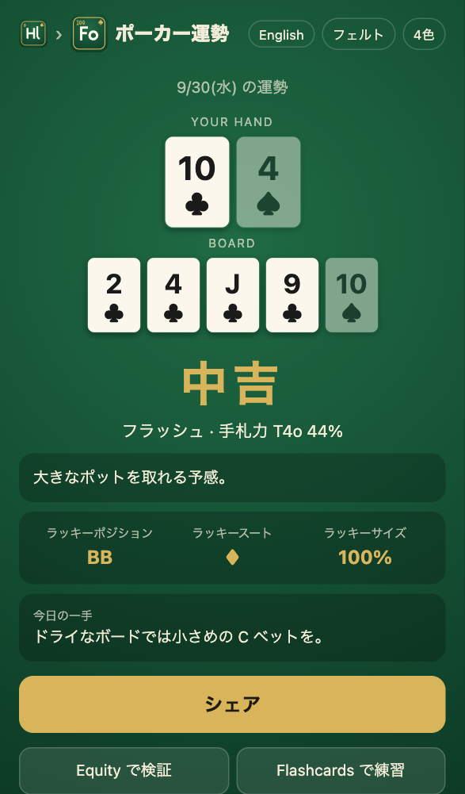

**[Fortune を開く](https://holdem-lab.com/fortune/)**。

- **毎日1回・7枚で占う**
  - ロイヤルフラッシュなら超大吉、ハイカードなら凶
  - 手札のプリフロップ勝率、ラッキーポジション・スート・サイズ、今日の一手つき
- **名前で占える**
  - 友達の名前を入れると、その人の今日の運勢がわかる
  - 名前を保存すると、別の端末でも同じ名前を保存すれば同じ運勢になる
- **画像つきでシェア**
  - スマホでは結果画像ごと共有し、リンクを開いた人にも同じ結果を見せる
- **Equity で検証**: 配られたハンドとボードをそのまま Equity で開ける
- **データは端末の中だけ**: 端末シードと保存名はブラウザにだけ保存し、サーバーには送らない

### 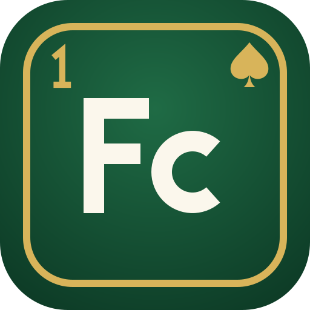 Flashcards

**勝率・アウツ・レンジ・ポットオッズを、指が覚えるまで。**<br>
数字と判断を間隔反復のフラッシュカードで身につける PWA。

 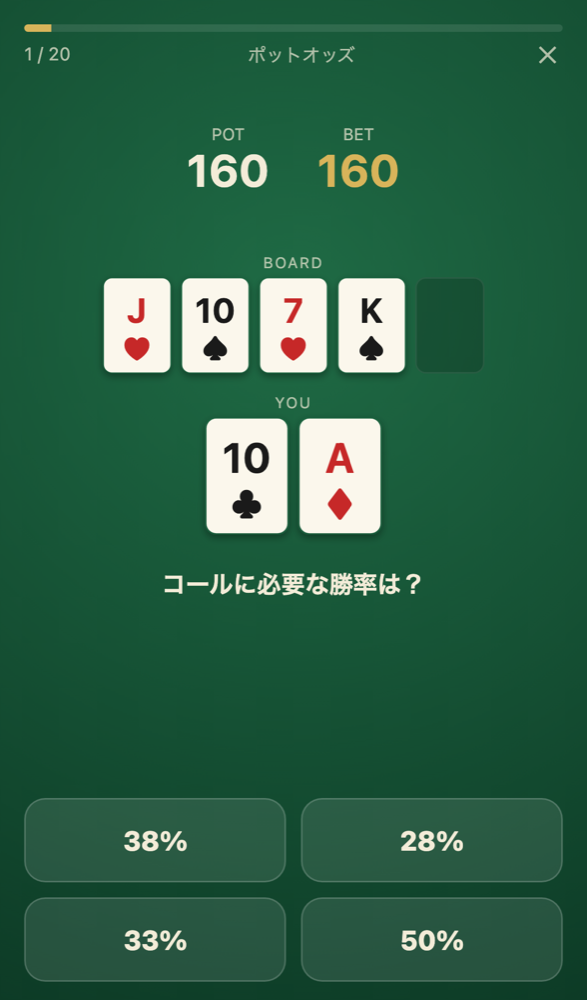 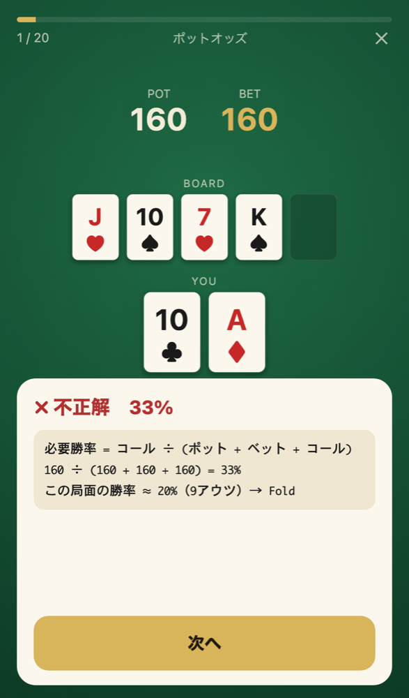

**[Flashcards を開く](https://holdem-lab.com/flashcards/)**。スマホで開いて「ホーム画面に追加」すると、オフラインでも使える。

- **4つの分野**
  - ハンド対ハンドの勝率（スライダーで回答）
  - アウツとリバーまでの確率
  - 6-max 100bb のプリフロップレンジ（RFI）
  - ポットオッズと MDF
- **問題は毎回生成**
  - 勝率はブラウザ内のモンテカルロ計算（Web Worker）で求める
  - アウツは山札を全部調べて正確に数える
  - 同じ問題でもスートや盤面は毎回変わる
- **間隔反復**
  - FSRS で次に出す時期を決める
  - 正誤・誤差・回答時間から評価を自動で付けるので、自分で採点する必要はない
- **解説つき**
  - 計算式と暗算の目安（2と4の法則など）を表示する
  - よくある計算ミスの選択肢を選ぶと、どこで間違えたかを指摘する
- **カードが動かない出題画面**
  - BOARD と自分のハンドは、どの分野でも、回答の前後でも同じ位置に出る
- **日本語／英語**、4つのテーマ（フェルト・ダーク・ライト・ミッドナイト）、4色デッキ
- **データは端末の中だけ**
  - 学習履歴はブラウザの IndexedDB に保存し、サーバーには送らない
  - JSON で書き出し・読み込みでき、統計や学習データのリセットもできる

### 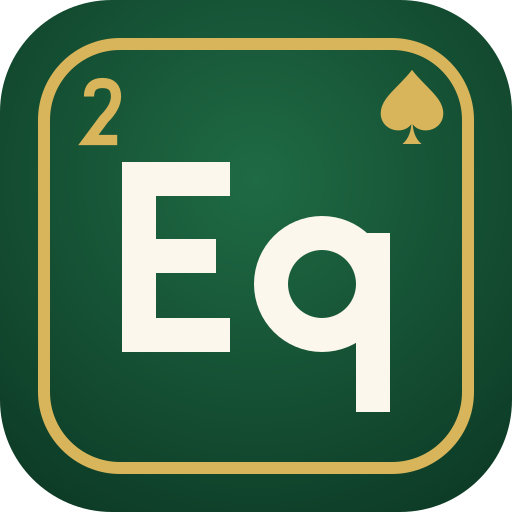 Equity

**2〜9人のハンドとレンジから、勝率をその場で。**<br>
実戦の検証と、ボードやレンジをいじって感覚を作るための勝率計算機。

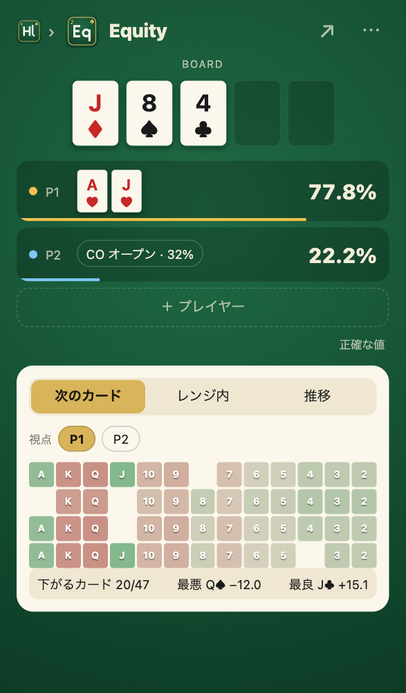 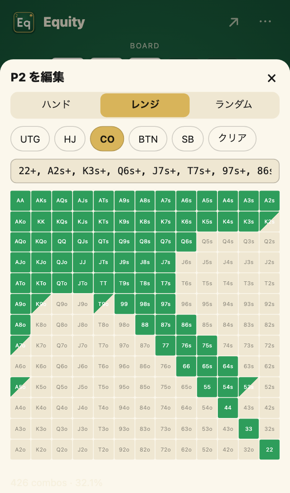 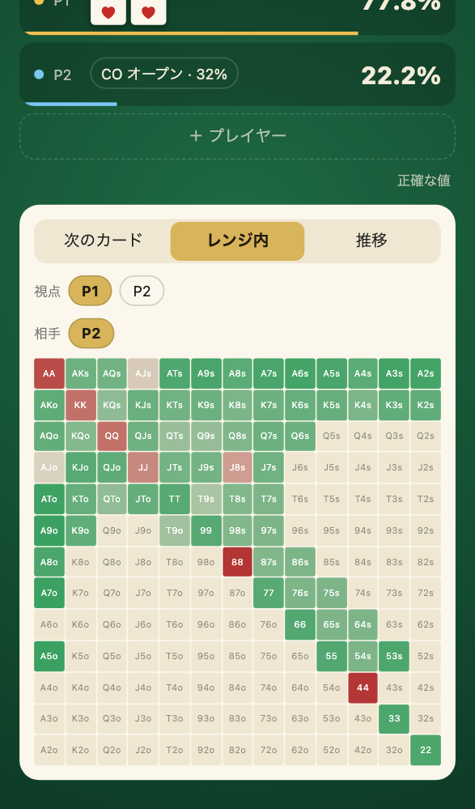

**[Equity を開く](https://holdem-lab.com/equity/)**。

- **ハンドでもレンジでも**
  - 各プレイヤーにハンド、レンジ、ランダムを割り当てる（最大9人）
  - レンジは 13×13 のグリッドを塗る、`TT+, AJs+, AQo:0.5` のように書く、6-max RFI のプリセットから選ぶ、のどれでも入れられ、3つは連動する
- **正確さと速さの両立**
  - 計算量が小さければ全通り数えた正確な値、大きければ複数の Web Worker でモンテカルロ計算し、誤差 ±0.1pt まで数字を更新し続ける
- **学習用の表示**
  - 次のカード: ターンやリバーの 52 枚ごとに勝率の増減を色で示し、タップでボードに置ける
  - レンジ内: 相手レンジのハンドごとの勝率をグリッドに重ねる
  - 推移: プリフロップからリバーまでの勝率の折れ線
- **URL で共有**: 入力はすべて URL に入るので、ブックマークや共有でそのまま再現できる

###  Chips

**チップトリックを、コマ送りで。**<br>
ポーカーチップの手遊びを、チップの動きと指の力点の 3D アニメーションで分解して見せる練習用 PWA。

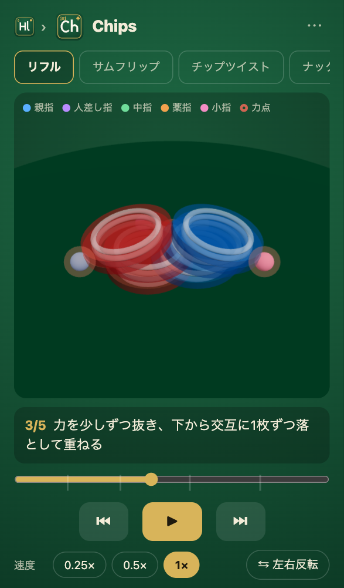 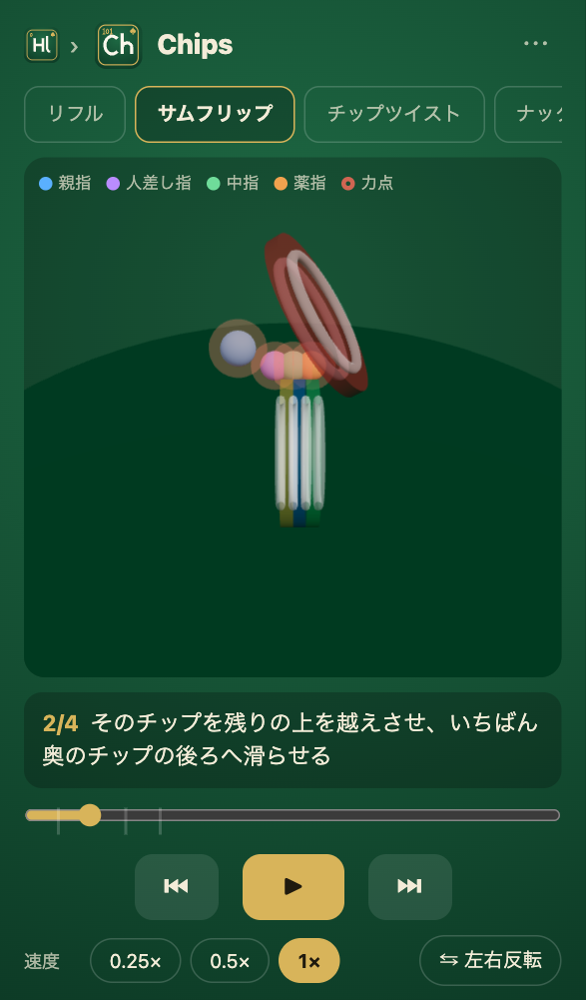 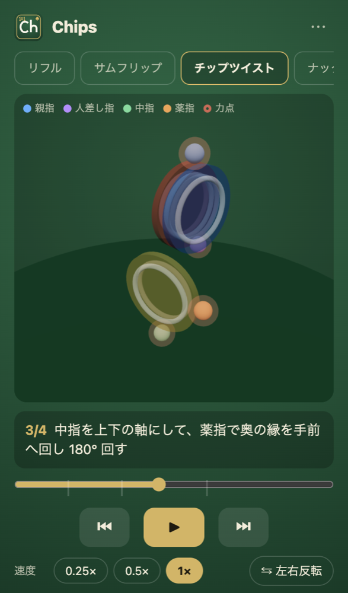 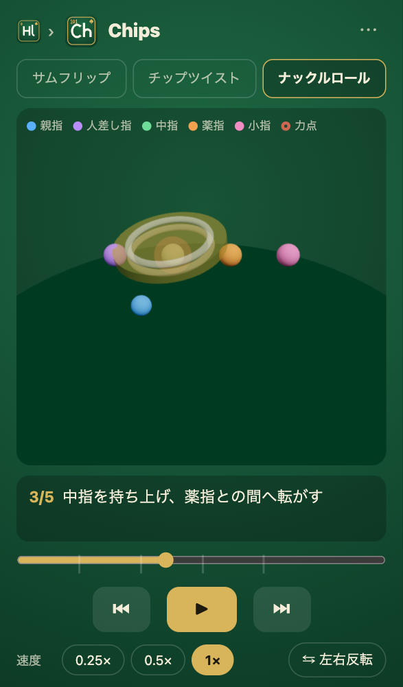

**[Chips を開く](https://holdem-lab.com/chips/)**。

- **4つの技**: リフル、サムフリップ、チップツイスト、ナックルロール
- **力点が見える**: 指先のマーカーは指ごとに色分けし、押している間は周りに赤い輪が付く。チップは半透明で、下にある指も見える
- **分解して見る**: ステップごとの字幕と ⏮ ⏭ でのステップ送り、0.25×・0.5× のスロー再生、自分・正面・斜め・真上・向かいの5視点
- **左利き対応**: 左右反転ボタンで鏡像にする

## 構成

計算・レンジ・問題生成は UI に依存しないパッケージに分けてあり、アプリを増やすときはこれを使い回す。

| パス | 内容 |
| --- | --- |
| `apps/flashcards` | Flashcards（React + Vite の PWA） |
| `apps/equity` | Equity（React + Vite の PWA） |
| `apps/home` | トップページ（Vite + TypeScript。アプリ一覧は `packages/assets/src/apps.ts` からビルド時に生成） |
| `apps/fortune` | Fortune（React + Vite の PWA） |
| `apps/chips` | Chips（React + Vite + three.js の PWA） |
| `packages/engine` | カード表現、5〜7枚の役判定、シード付き乱数、モンテカルロ勝率、アウツ、ドロー分類、多人数・レンジ対応の勝率セッション（全通り／モンテカルロ） |
| `packages/ranges` | レンジ表記（`A2s+` など）の展開と検証、6-max 100bb RFI データ、重み付きレンジの表記の解析と生成 |
| `packages/quiz` | 問題の型、4分野の問題生成、採点、問題文の日英辞書 |
| `packages/ui` | カード・ボードの SVG コンポーネントとテーマのトークン、カードピッカーとレンジグリッド、各アプリのヘッダーからホームへ戻るロゴ（`HomeLink`） |
| `packages/assets` | ロゴとアイコンの生成（周期表のマスの形。`element-icon <番号> <記号> <出力.svg>`）、アプリ一覧（`src/apps.ts`。ポート、トップページに載せる説明とスクショ） |

## 開発

Node.js 24 以上と pnpm（`corepack enable` で `packageManager` のバージョンが入る）が必要。

```sh
pnpm install
pnpm dev                                   # トップページ（http://localhost:5170/）とすべてのアプリを起動
pnpm --filter @holdem-lab/flashcards dev   # 1つだけ起動
```

ルートのコマンドは、特定のアプリを指定せず、すべてのワークスペースに対して実行される。

| コマンド | 内容 |
| --- | --- |
| `pnpm dev` | `apps/*`（トップページを含む）の開発サーバーを並列に起動（ポートは `packages/assets/src/apps.ts` で固定） |
| `pnpm build` | 本番ビルド |
| `pnpm test` | 単体テスト（Vitest） |
| `pnpm typecheck` | 型チェック |
| `pnpm lint` | oxlint |
| `pnpm e2e` | E2E テスト（Playwright。初回は `pnpm exec playwright install chromium`） |
| `pnpm check-licenses` | アプリに同梱する依存パッケージのライセンス確認 |

`main` への push で GitHub Pages にデプロイされる。`apps/home` はサイトのルート（`https://holdem-lab.com/`）に、それ以外の `apps/<アプリ名>` は `https://holdem-lab.com/<アプリ名>/` に置かれる。トップページのアプリ一覧と開発サーバーのポートは `packages/assets/src/apps.ts` の表から作られる。アプリを追加したら、この表に1行足し（トップページ用の説明 `lead` と、`docs/assets/` に置いた縦長スクショのファイル名 `shot` も書く）、次の番号と2文字の記号でアイコンを作る（学習用は 1 からの連番、遊び系は 100 からの連番）（例: `element-icon 2 Eq public/icon.svg`。Flashcards は `pnpm --filter @holdem-lab/flashcards icons` で PNG まで生成する）。

## レンジデータについて

`packages/ranges/data/6max-100bb-rfi.json` は、一般に公開されている GTO 寄りのチャートを参考にした近似値で、ソルバーの出力そのものではない。
- 頻度 0.5 のハンドは混合戦略として扱い、Raise と Fold のどちらを選んでも正解にする
- 自分のレンジに合わせて JSON を書き換えて使うことを想定している

## ライセンス

[MIT](LICENSE)
