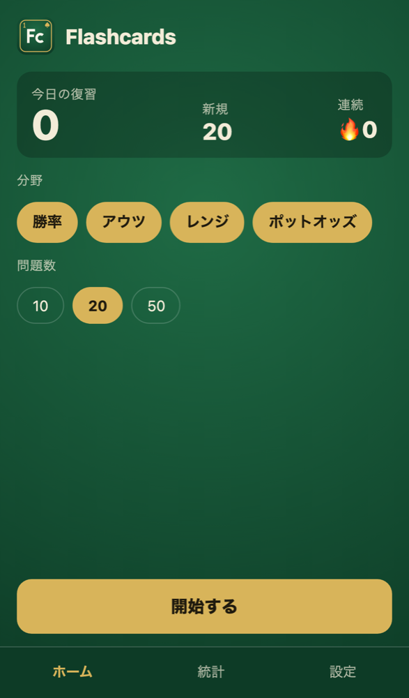

<div align="center">


# holdem-lab

**テキサスホールデムの学習ツール集。**<br>
勝率計算や役判定のエンジンと、それを使うアプリをまとめたモノレポ。

*Texas Hold'em study tools, in one monorepo.*


</div>

## アプリ

###  Flashcards

**勝率・アウツ・レンジ・ポットオッズを、指が覚えるまで。**<br>
数字と判断を間隔反復のフラッシュカードで身につける PWA。

  

**[Flashcards を開く](https://jackchuka.com/holdem-lab/flashcards/)**。スマホで開いて「ホーム画面に追加」すると、オフラインでも使える。

- **4つの分野**
  - ハンド対ハンドの勝率（スライダーで回答）
  - アウツとリバーまでの確率
  - 6-max 100bb のプリフロップレンジ（RFI）
  - ポットオッズと MDF
- **問題は毎回生成**
  - 勝率はブラウザ内のモンテカルロ計算（Web Worker）で求める
  - アウツは山札を全部調べて正確に数える
  - 同じ問題でもスートや盤面は毎回変わる
- **間隔反復**
  - FSRS で次に出す時期を決める
  - 正誤・誤差・回答時間から評価を自動で付けるので、自分で採点する必要はない
- **解説つき**
  - 計算式と暗算の目安（2と4の法則など）を表示する
  - よくある計算ミスの選択肢を選ぶと、どこで間違えたかを指摘する
- **カードが動かない出題画面**
  - BOARD と自分のハンドは、どの分野でも、回答の前後でも同じ位置に出る
- **日本語／英語**、4つのテーマ（フェルト・ダーク・ライト・ミッドナイト）、4色デッキ
- **データは端末の中だけ**
  - 学習履歴はブラウザの IndexedDB に保存し、サーバーには送らない
  - JSON で書き出し・読み込みでき、統計や学習データのリセットもできる

## 構成

計算・レンジ・問題生成は UI に依存しないパッケージに分けてあり、アプリを増やすときはこれを使い回す。

| パス | 内容 |
| --- | --- |
| `apps/flashcards` | Flashcards（React + Vite の PWA） |
| `packages/engine` | カード表現、5〜7枚の役判定、シード付き乱数、モンテカルロ勝率、アウツ、ドロー分類 |
| `packages/ranges` | レンジ表記（`A2s+` など）の展開と検証、6-max 100bb RFI データ |
| `packages/quiz` | 問題の型、4分野の問題生成、採点、問題文の日英辞書 |
| `packages/ui` | カード・ボードの SVG コンポーネントとテーマのトークン |
| `packages/assets` | ロゴとアイコンの生成（周期表のマスの形。`element-icon <番号> <記号> <出力.svg>`） |

## 開発

Node.js 24 以上と pnpm（`corepack enable` で `packageManager` のバージョンが入る）が必要。

```sh
pnpm install
pnpm dev                                   # すべてのアプリを起動（ポートは 5173 から順に割り当て）
pnpm --filter @holdem-lab/flashcards dev   # 1つだけ起動
```

ルートのコマンドは、特定のアプリを指定せず、すべてのワークスペースに対して実行される。

| コマンド | 内容 |
| --- | --- |
| `pnpm dev` | `apps/*` の開発サーバーを並列に起動 |
| `pnpm build` | 本番ビルド |
| `pnpm test` | 単体テスト（Vitest） |
| `pnpm typecheck` | 型チェック |
| `pnpm lint` | oxlint |
| `pnpm e2e` | E2E テスト（Playwright。初回は `pnpm exec playwright install chromium`） |
| `pnpm check-licenses` | アプリに同梱する依存パッケージのライセンス確認 |

`main` への push で GitHub Pages にデプロイされる。`apps/<アプリ名>` はそれぞれ `https://jackchuka.com/holdem-lab/<アプリ名>/` に置かれる。アプリを追加したら、ルートの一覧ページ `site-root/index.html` にリンクを足し、次の番号と2文字の記号でアイコンを作る（例: `element-icon 2 Eq public/icon.svg`。Flashcards は `pnpm --filter @holdem-lab/flashcards icons` で PNG まで生成する）。

## レンジデータについて

`packages/ranges/data/6max-100bb-rfi.json` は、一般に公開されている GTO 寄りのチャートを参考にした近似値で、ソルバーの出力そのものではない。
- 頻度 0.5 のハンドは混合戦略として扱い、Raise と Fold のどちらを選んでも正解にする
- 自分のレンジに合わせて JSON を書き換えて使うことを想定している

## ライセンス

[MIT](LICENSE)
